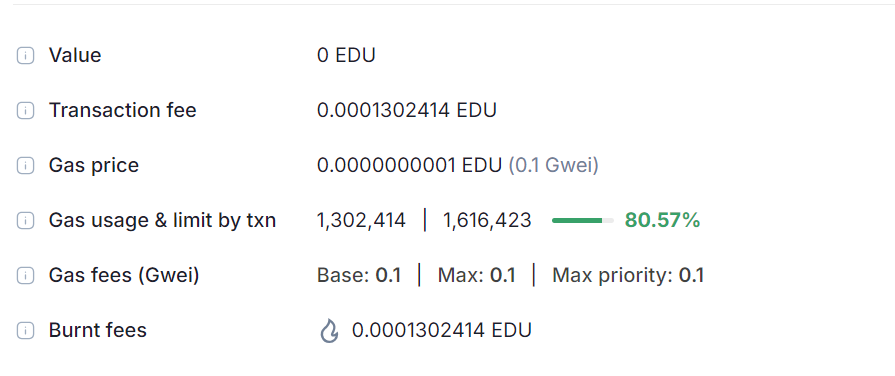

Here's a `README.md` file for your Job Placement smart contract project:

```markdown
# Job Placement Smart Contract


## Vision

The Job Placement smart contract is designed to streamline the job placement process on the Ethereum blockchain. It provides a decentralized platform where graduates can register their profiles and employers can post job opportunities. The contract facilitates matching graduates with job positions based on their skills and qualifications, and allows graduates to accept job offers. This system aims to enhance transparency, reduce the reliance on intermediaries, and create a more efficient job placement process.

## Project Features

- **Graduate Registration**: Graduates can register by providing their name, skills, and qualifications. Each graduate is assigned a unique ID and their wallet address is recorded.
- **Job Posting**: Employers can post job vacancies by specifying the job title, required skills, and qualifications. Each job is assigned a unique ID and is associated with the employer's address.
- **Job Matching**: The contract allows checking whether a graduate's skills and qualifications match the requirements of a specific job.
- **Job Acceptance**: Graduates can accept job offers if they meet the job criteria and if the job is still available. Once accepted, the job is marked as filled.

## Future Scope

- **Resume Uploading**: Integrate functionality to upload and store resumes or additional documents related to the graduate’s profile.
- **Advanced Matching Algorithms**: Implement more sophisticated algorithms for matching graduates with jobs based on experience, location, or other factors.
- **Decentralized Reputation System**: Introduce a reputation or rating system for both graduates and employers to build trust and reliability within the platform.
- **Job Application Tracking**: Develop features to track the status of job applications and interviews.
- **Integration with External Data**: Connect with other decentralized applications or oracles to pull in additional data for job matching or verification purposes.

## Project Structure

- **`JobPlacement.sol`**: Contains the core logic of the smart contract including:
  - Graduate and Job structures.
  - Functions to add graduates, post jobs, match jobs, and accept job offers.
  - Events for tracking contract interactions.
  - Utility functions for string comparison and existence checks.

## Developer Details

- **Author**: S.Sivateja
- **Email**: [Your Email]
- **Date**: 25/08/24

## Getting Started

1. **Install Dependencies**: Ensure you have the necessary tools for Solidity development such as Truffle or Hardhat.
2. **Deploy the Contract**: Compile and deploy the smart contract to the Ethereum blockchain using your preferred development environment.
3. **Interact with the Contract**: Use web3.js or ethers.js to interact with the smart contract from a frontend application or script.
4. **Testing**: Write and execute test cases to ensure all functionalities are working as expected.

## License

This project is licensed under the MIT License - see the [LICENSE](LICENSE) file for details.

## Deployment 
Chain Name : Educhain Open Campus
Contract id :0x82b7d8bb677d47a2d1e6afda5efc0c0ceca0d59ec7e59009b34f7f1222f8d106



